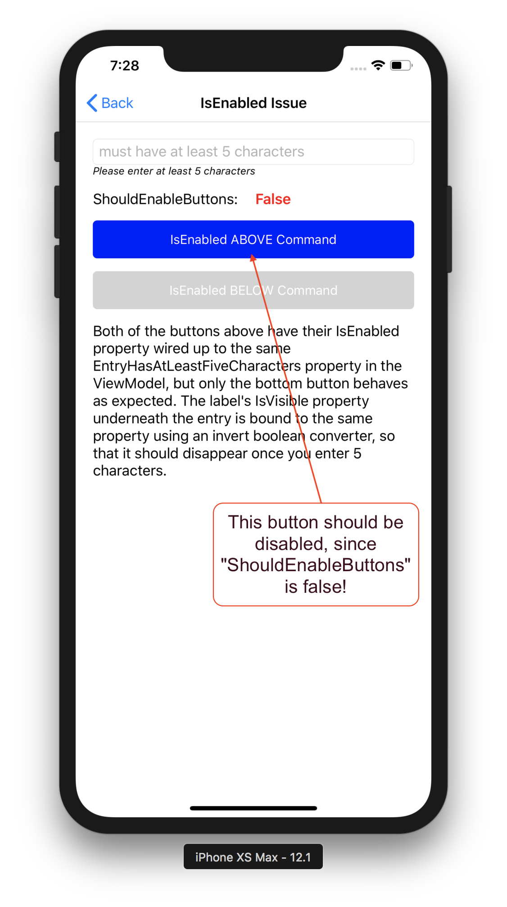

# Xamarin.Forms The order of 'IsEnabled' and 'Command' in xaml should not matter
My team and I were happily coding away our Xamarin.Forms app (version 3.5 of the Xamarin.Forms nuget package). We were developing a new page, and had a bool property in our viewModel that was bound to two controls in our view:
1. A Label's IsVisible property was bound so that it would be visible until the text in an Entry field was valid. Once the Entry text was valid, the Label (which informed the user that the text was not yet valid) should become invisible.
2. A Button's IsEnabled property was bound so that when the text in an Entry field was invalid, the button would be disabled.

The label was working perfectly. When the page loaded, the Label indicating invalid entry text was visible. The instant you entered text that passed validation in the Entry, the label would disappear. However, the button was not enabling/disabling as it should have, even though its IsEnabled property was bound to the exact same bool property. What gives??

After some hunting around, we found [this issue](https://github.com/xamarin/Xamarin.Forms/issues/2758) on the Xamarin.Forms GitHub page. Turns out we were not the first to stumble across this 'feature'. The problem was that we had declared the IsEnabled property of the button *above* the Command property. If we had reversed that order in our xaml, things would have worked fine. 

## Why is this repo here?
There are a couple of reasons for this repository:
1. To demonstrate the issue in a fairly simple app, in hopes that the Xamarin.Forms team might either fix the issue, or at least document it with some sort of clear warning. Please have a look at the [master branch](https://github.com/jbachelor/XamarinFormsIsEnabledIssue) to experience the issue for yourself.
2. To go over several methods of avoiding the issue using Prism's DelegateCommand features:
    * Create a CanExecute method rather than using the IsEnabled property at all, and manually call MyCommand.RaiseCanExecuteChanged when the relevant property or properties have changed ([CanExecute branch](https://github.com/jbachelor/XamarinFormsIsEnabledIssue/tree/CanExecute)).
    * **My personal favorite:**  Create a CanExecute method and make use of the ObservesProperty feature to avoid having to manually call MyCommand.RaiseCanExecuteChanged ([observesProperty branch](https://github.com/jbachelor/XamarinFormsIsEnabledIssue/tree/observesProperty)).
    * Use the ObservesCanExecute feature to avoid having to write a CanExecute method *and* calling MyCommand.RaiseCanExecuteChanged in one fell swoop. This one provides the most compact implementation, but is limited to fairly simple use cases ([observesCanExecute branch](https://github.com/jbachelor/XamarinFormsIsEnabledIssue/tree/observesCanExecute)).

***

***

## Resources
* [Xamarin.Forms IsEnabled issue](https://github.com/xamarin/Xamarin.Forms/issues/2758)
* [Xamarin.Forms IsEnabled documentation](https://docs.microsoft.com/en-us/dotnet/api/xamarin.forms.visualelement.isenabled?view=xamarin-forms)
* [Prism Commanding documentation](http://prismlibrary.github.io/docs/commanding.html)
